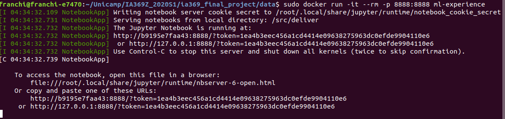

# IA 369 - 1S/2020: Final Project - Executable Papers
![GitHub issues][license]

This repository contains the executable paper wrote during the IA369 - 1S/2020 lectures.
In order to reproduce it, please, follow the sections below.

## Structure

**Directories**
* [data][data]: models, images, and videos used at the executable paper
* [deliver][deliver]: the executable paper

## How to Execute the Paper

### Install Docker
For linux users, do the following:
```console
# apt-get update
# apt-get install docker.io
```

### Build the Dockerfile
Clone this repository:
```console
$ git clone https://github.com/marcofrk/ia369_final_project.git
```

Enter at the repo and build the docker container:
```console
$ cd ia369_final_project
# docker build -t ml-experience .
```


**NOTE:**
This tutorial is fully based on GNU/Linux Distribution `Ubuntu 18.04` as host machine.

### Execute the Paper
Run the docker image:
```console
# docker run -it --rm --user=$(id -u $USER):$(id -g $USER) \
    --env="DISPLAY" \
    --workdir="/home/$USER" \
    --volume="/home/$USER:/home/$USER" \
    --volume="/etc/group:/etc/group:ro" \
    --volume="/etc/passwd:/etc/passwd:ro" \
    --volume="/etc/shadow:/etc/shadow:ro" \
    --volume="/etc/sudoers.d:/etc/sudoers.d:ro" \
    --volume="/tmp/.X11-unix:/tmp/.X11-unix:rw" \
    -p 8888:8888 ml-experience
```
Click at the returned link (127.0.0.1), as shown at the image below:


The Notebook can be found on `deliver/improving-machine-learning-experience.ipynb`.

**NOTE:**
*Due to the X server security reasons, docker will not be able to display the video at the
created screen. It will not impact at the results, but can be frustrated.
Plus, be sure to use sudo privilege when required!*

[data]: https://github.com/marcofrk/ia369_final_project/tree/master/data
[deliver]: https://github.com/marcofrk/ia369_final_project/tree/master/deliver
[License]: https://img.shields.io/badge/License-MIT-blue
